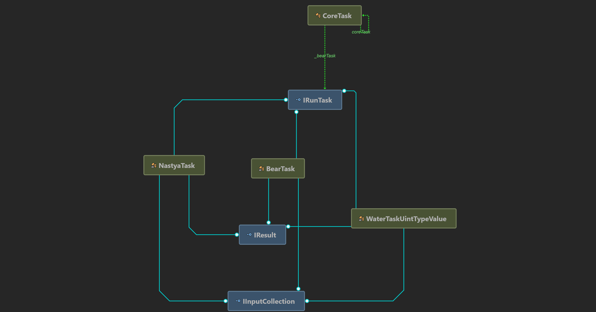

 # Репозиторий создан по одному из тестовых заданий
 ***
Проект состоит из 3 проектов: консольное приложение (_ConsoleApp_), библиотека классов (_Lib_), тестового проекта (_Test_)

То есть, доступ к функционалу библиотеки осуществляется через класс _CoreTask_.

Иструкции по работе консольного приложения выводятся при запуске программы.